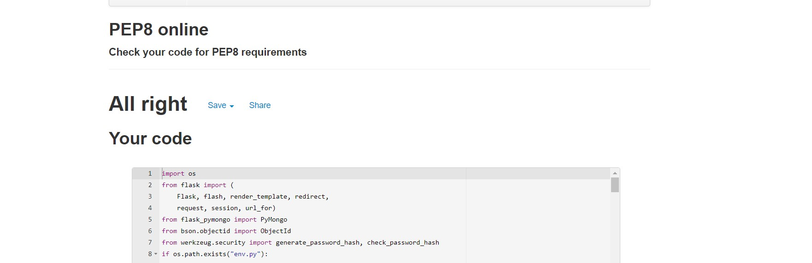

# The Alton Towers Foodie project
[View the live project here.](https://flask-review-a-restaurant.herokuapp.com/register)

This is a food review site for the Alton Towers theme park. The site is pointed at the theme park visitors. It helps to plan your visit based on the reviews and ratings of other visitors or to rate places that you have visited.
There currently 12 places to eat and snack at the resort, and all 12 are available to rate.
Developer would add a new Restaurant with the cover image whenever new one would open in the Alton Towers.

# User Experience (UX)
## User stories

   #### **First time visitor goals**
   1. As a First Time Visitor, I want to immediately identify the main purpose of the website.
   2. As a First Time Visitor, I want to easily navigate through the website.
   3. As a First Time Visitor, I want to Register as a new user.
   4. As a First Time Visitor, I want to know that registration will allow to post reviews.
   5. As a First Time Visitor, I want the website's colour scheme and general feel to reflect the theme of the site.
   6. As a First Time Visitor, I want to have fun reading reviews.
   
   #### **Returning Visitor Goals**
   1. As a Returning Visitor, I want to Login to my account.
   2. As a Returning Visitor, I want to post reviews.
   3. As a Returning Visitor, I want to read my reviews in a separate section.
   4. As a Returning Visitor, I want to edit/update my reviews.
   5. As a Returning Visitor, I want to delete my reviews.
   6. As a Returning Visitor, I want to be able to log out of my account.

   #### **Frequent User Goals**
   1. As a Frequent User, I want to have quick access to new reviews.

## Design

  #### **Colour scheme**
  - Minimal palette consisting of shades of orange with white text. Orange color is fun, energetic, attention grabbing.
  - All the elements use Materialize native font stack which adapts to the device. These fonts are familiar to the user, professional and clean looking. 
  #### **Imagery**
  - Images only appear on All Reviews section, as a cover images for the Specific Restaurant. Images taken from the 
  Alton Towers official website[Theme Park](https://www.altontowers.com/explore/theme-park/restaurants-shops/), [CBeebies Land](https://www.altontowers.com/explore/cbeebies-land/restaurants-shops/).
  Every image is different apart from the two coffee shops. 

## Wireframes

## Features

# Further development
* Next step in the development would be calculating average score for each restaurant and displaying it at every review with the current score included in the calculation.
* Then, the Interactive Resort Map : Using an API such as [BestTime API demo Alton Towers](https://besttime.app/demo/radar?q=Alton+towers+in+Alton&map_lat=52.9844202&map_lng=-1.8840942&lat_min=52.9771659&lat_max=52.9916745&lng_min=-1.8964981&lng_max=-1.8716904&map_z=15&collection_id=col_39e8cbfdf60940248ea139fa17155d01&busy_conf=any&order_by=reviews&order=DESC) to see live foot traffic.

# Technologies Used
## Languages Used
   - HTML
   - CSS
   - JavaScript
   - Python

## Frameworks, Libraries & Programs Used
1. Add all the libraries
-
2. Git:
- Git was used for version control by utilizing the Gitpod terminal to commit to Git and Push to GitHub.
3. GitHub:
- GitHub is used to store the project's code after being pushed from Git.
4. Balsamiq:
- Balsamiq was used to create the wireframes during the design process.
5. Materialize:
- Materialize was used to assist with the responsiveness and styling of the website.
6. Font Awesome:
- Font Awesome was used to style icons in the quiz outcome paragraph.
8. Web Formatter:
- Web Formatter was used to add proper indentation and improve readability on HTML files.

# Testing
* To be added  - all manual testing only?

## Testing User Stories from User Experience (UX) Section

#### **First time visitor goals**

#### **Returning Visitor Goals**

 
#### **Frequent User Goals**

### The W3C Markup Validator and W3C CSS Validator Services were used to validate every page of the project to ensure there were no syntax errors in the project.
 * HTML validator results ! All the errors that HTML validator has returned were related the use of Jinja templates.   Base Template   All reviews template    Register template   
 * CSS validator results

### [PEP8 Online](http://pep8online.com/) was used to check my code for PEP8 requirements
* PEP8 checker results 

### Lighthouse was used to measure performance.

### Chrome developer tools 
* Used to test responsiveness and functionality on various devices.

## Functionality testing

### Navbar

## Further testing

## Bugs

# Deployment
## GitHub Pages
The project was deployed to GitHub Pages using the following steps...
1. Log in to GitHub and locate the [GitHub Repository](https://github.com/emilija-smitaite/review-a-restaurant)
2. At the top of the Repository (not the top of the page), locate the "Settings" button on the menu.
3. Scroll down the Settings page until you locate the "GitHub Pages" Section.
4. Under "Source", click the dropdown called "None" and select "Main".
5. The page will automatically refresh.
6. Scroll back down through the page to locate the now published site link in the "GitHub Pages" section.

## Forking the GitHub Repository
By forking the GitHub Repository we make a copy of the original repository on our GitHub account to view and/or make changes without affecting the original repository by using the following steps...
1. Log in to GitHub and locate the [GitHub Repository](https://github.com/emilija-smitaite/review-a-restaurant)
2. At the top of the Repository (not top of page) just above the "Settings" button on the menu, locate the "Fork" button.
3. You should now have a copy of the original repository in your GitHub account.

## Making a Local Clone
1. Log in to GitHub and locate the [GitHub Repository](https://github.com/emilija-smitaite/review-a-restaurant)
2. Under the repository name, click "Clone or download".
3. To clone the repository using HTTPS, under "Clone with HTTPS", copy the link.
4. Open Git Bash
5. Change the current working directory to the location where you want the cloned directory to be made.
6. Type "git clone" and then paste the URL you copied in Step 3.
7. Press Enter. Your local clone will be created.

# Credits
## Content
* All content was written by the developer. Any code that was not written by the developer was referenced in a document.

1. Used to find regular expression to validate email input when creating a new user.
https://regexlib.com/Search.aspx?k=email

## Media 
* [Restaurant cover images](https://www.altontowers.com/explore/theme-park/restaurants-shops/)(https://www.altontowers.com/explore/cbeebies-land/restaurants-shops/) Taken from the official Alton Towers website.

## Acknowledgements

