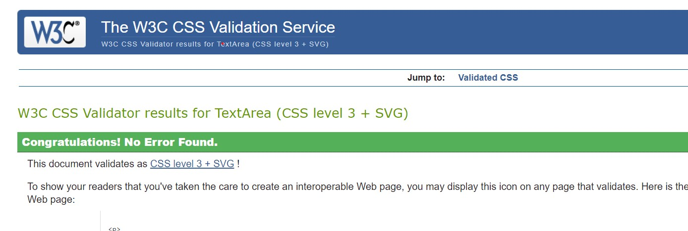

# The Alton Towers Foodie project
[View the live project here.](https://flask-review-a-restaurant.herokuapp.com/)

This is a food review site for the Alton Towers theme park. The site is pointed at the theme park visitors. It helps to plan your visit based on the reviews and ratings and to rate places that you have visited.
There are currently 12 places to eat and snack at the resort, and all 12 are available to rate.
The developer would add a new Restaurant with the cover image whenever a new one would open in the Alton Towers.

# User Experience (UX)
## User stories

   #### **First time visitor goals**
   1. As a First Time Visitor, I want to immediately identify the main purpose of the website.
   2. As a First Time Visitor, I want to easily navigate through the website.
   3. As a First Time Visitor, I want to Register as a new user.
   4. As a First Time Visitor, I want to know that registration will allow me to post reviews.
   5. As a First Time Visitor, I want the website's colour scheme and general feel to reflect the theme of the site.
   6. As a First Time Visitor, I want to have fun reading reviews.
   
   #### **Returning Visitor Goals**
   1. As a Returning Visitor, I want to Login into my account.
   2. As a Returning Visitor, I want to post reviews.
   3. As a Returning Visitor, I want to read my reviews in a separate section.
   4. As a Returning Visitor, I want to edit/update my reviews.
   5. As a Returning Visitor, I want to delete my reviews.
   6. As a Returning Visitor, I want to be able to log out of my account.

   #### **Frequent User Goals**
   1. As a Frequent User, I want to have quick access to new reviews.

## Design

  #### **Colour scheme**
  - Minimal palette consisting of shades of orange with white text. Orange color is fun, energetic, and attention grabbing.
  - All the elements use Materialize native font stack which adapts to the device. These fonts are familiar to the user, professional and clean looking. 
  #### **Imagery**
  - Images only appear in All Reviews section, as cover images for the Specific Restaurant. Images were taken from the 
  Alton Towers official website[Theme Park](https://www.altontowers.com/explore/theme-park/restaurants-shops/), [CBeebies Land](https://www.altontowers.com/explore/cbeebies-land/restaurants-shops/).
  Every image is different apart from the two coffee shops. 

## Wireframes
- Mobile Home page 

- Desktop Home page  

## Features

* Responsive on all device sizes
* Intuitive and easy to use.
* User Registration, Login, Logout features implemented.

### CRUD functionality
All aspects of CRUD functionality are included:
- Create:
Add Review
- Read:
All Reviews
My Reviews
- Update:
Edit Review
- Delete:
Delete Review

# Further development
* Next step in the development would be calculating the average score for each restaurant and displaying it at every review with the current score included in the calculation.
* Then, the Interactive Resort Map : Using an API such as [BestTime API demo Alton Towers](https://besttime.app/demo/radar?q=Alton+towers+in+Alton&map_lat=52.9844202&map_lng=-1.8840942&lat_min=52.9771659&lat_max=52.9916745&lng_min=-1.8964981&lng_max=-1.8716904&map_z=15&collection_id=col_39e8cbfdf60940248ea139fa17155d01&busy_conf=any&order_by=reviews&order=DESC) to see live foot traffic.

# Technologies Used
## Languages Used
   - [HTML](https://developer.mozilla.org/en-US/docs/Web/HTML)
   - [CSS](https://developer.mozilla.org/en-US/docs/Web/CSS)
   - [JavaScript] (https://developer.mozilla.org/en-US/docs/Web/JavaScript)
   JavaScript was used to initialize Materialize CSS components.
   - [Python](https://www.python.org/)
   Python was used to run the site.

## Frameworks, Libraries, Tools & Programs Used
1. Flask
- To render page templates.
2. MongoDB Atlas
- A cloud-based Non-Relational backend database hosting service.
3. Heroku
- Used to deploy this application.
4. Werkzeug
- A Flask dependency. A web application library used for hashing user passwords for Python.
5. Jinja
- A Flask dependency. Templating language is used to display data from the backend in HTML.
6. Pymongo and Flask-PyMongo
- To connect Python and Flask to the MongoDB database
7. jQuery
- Used to simplify JS initialization when using Materialize CSS.
8. Git 
- Git was used for version control by utilizing the Gitpod terminal to commit to Git and Push to GitHub.
9. GitHub:
- GitHub is used to store the project's code after being pushed from Git.
10. Balsamiq:
- Balsamiq was used to create the wireframes during the design process.
11. Materialize:
- Materialize was used to assist with the responsiveness and styling of the website.
12. Font Awesome:
- Font Awesome was used to style icons in the nav bar.
13. Web Formatter:
- Web Formatter was used to add proper indentation and improve readability on HTML files.

# Testing

## Testing User Stories from User Experience (UX) Section

#### **First time visitor goals**
   1. As a First Time Visitor, I want to immediately identify the main purpose of the website. 
   The landing page displays the site name and takes the user straight to All Reviews. 
   
   2. As a First Time Visitor, I want to easily navigate through the website. 
   Immediately apparent nav bar, mobile side nav.  
   
   3. As a First Time Visitor, I want to Register as a new user. 
   
   4. As a First Time Visitor, I want to know that registration will allow me to post reviews. 
   User is informed of the registration requirement to post reviews.
   5. As a First Time Visitor, I want the website's colour scheme and general feel to reflect the theme of the site. 
   The clean, simplistic design is universal. Orange colour acts as a suggestion of fun, energy and warmth - all of which are suitable for a theme park restaurant review site.
   6. As a First Time Visitor, I want to have fun reading reviews. 
   Review panels are informative and compact, score, image and user name make it more fun to read.
   

#### **Returning Visitor Goals**
   1. As a Returning Visitor, I want to Log in to my account. 
   Login page is displayed at the nav bar.  
   
   2. As a Returning Visitor, I want to post reviews. 
   
   3. As a Returning Visitor, I want to read my reviews in a separate section. 
   
   4. As a Returning Visitor, I want to edit/update my reviews. 
   
   5. As a Returning Visitor, I want to delete my reviews. 
   Users can only Edit and Delete reviews they posted themselves.  
   
   6. As a Returning Visitor, I want to be able to log out of my account. 
   Log Out page is available for logged-in users.
 
#### **Frequent User Goals**
   1. As a Frequent User, I want to have quick access to new reviews. 
   Logged in user will see all the new reviews on the landing page.

### The W3C Markup Validator and W3C CSS Validator Services were used to validate every page of the project to ensure there were no syntax errors in the project.
 * HTML validator results ! All the errors that HTML validator has returned were related to the use of Jinja templates.   Base Template    [All reviews template](static/images/html-checker.jpg)   [Register template](static/images/html-checker.jpg)  
 * CSS validator results

### [PEP8 Online](http://pep8online.com/) was used to check my code for PEP8 requirements
* PEP8 checker results 

### Lighthouse was used to measure performance.
* Lighthouse report 

### Chrome developer tools 
* Used to test responsiveness and functionality on various devices.

## Functionality testing

### All the aspects of CRUD functionality were tested by Creating, Reading, Updating and Deleting reviews.
### User authentication was tested:
#### Forms will only accept required types of input.
- Tested by inputting other than the required text.
#### Duplicate usernames are not accepted.
- Tested by trying to create a username with the same name.
#### Password hash used for security.
- Tested by trying to retrieve passwords manually from the database.

## Further Testing
* Website was given to friends and family to test on various devices. Good responsiveness and functionality were reported.

## Database Layout

Database name: review_collector

|Collection | Field            | Type     |
|-----------|-----------------:|:--------:|
|restaurants| _id              | ObjectId |
|           | restaurant_name  | string   |
| reviews   | _id              | ObjectId |
|           | restaurant_name  | string   |
|           | score            | string   |
|           | review_text      | string   |
|           | posted_by        | string   |
| users     | _id              | ObjectId |
|           | username         | string   |
|           | email            | string   |
|           | password         | string   |

## Bugs

1. Relative file path when displaying cover images in My Reviews:
The relative file path was preventing the image from displaying. 
Adding / at the front of the file path made it into an absolute file path and had solved the issue.

# Deployment

## Heroku
The project was developed in Gitpod, pushed to GitHub, and then deployed on Heroku.
You will need to create [Heroku](https://www.heroku.com) account.
1. Create requirements.txt file using the command:  pip3 freeze --local > requirements.txt
2. Create procfile using command: echo web: python app.py > Procfile
Remove empty line if there is one.
3. Commit those two files to Github
4. Create a new app in Heroku by clicking "New", "Create New App", give it unique name.
5. From the dashboard click "Deploy" then "Deployment Method", select "GitHub".
6. Find your repo and connect.
7. In the dashboard click "Settings" then "Reveal Config Vars"
8. Set Config Vars: 
IP - 0.0.0.0 
MONGO_DBNAME - USER_MONGODB_NAME 
MONGO_URI - USER_MONGODB_URI 
PORT -   5000 
Secret_Key - USER_SECRET_KEY 
9. Back to "Deploy" section, click "Enable Automatic Deploys"
10. Your app URL can be found at "Settings", "App Information", "Heroku git URL".

## MongoDB Atlas for Database Usage
Mongo DB Atlas was used for the project's backend database functionality.  
[Quick tutorial on Mongo DB Atlas](https://www.mongodb.com/basics/mongodb-atlas-tutorial)

## Forking the GitHub Repository
By forking the GitHub Repository we make a copy of the original repository on our GitHub account to view and/or make changes without affecting the original repository by using the following steps...
1. Log in to GitHub and locate the [GitHub Repository](https://github.com/emilija-smitaite/review-a-restaurant)
2. At the top of the Repository (not top of the page) just above the "Settings" button on the menu, locate the "Fork" button.
3. You should now have a copy of the original repository in your GitHub account.

## Making a Local Clone
1. Log in to GitHub and locate the [GitHub Repository](https://github.com/emilija-smitaite/review-a-restaurant)
2. Under the repository name, click "Clone or download".
3. To clone the repository using HTTPS, under "Clone with HTTPS", copy the link.
4. Open Git Bash
5. Change the current working directory to the location where you want the cloned directory to be made.
6. Type "git clone" and then paste the URL you copied in Step 3.
7. Press Enter. Your local clone will be created.

Technologies needed to be installed:
- PIP3
- Python3

# Credits

## Code

* All content was written by the developer. Any code that was not written by the developer was referenced in a document.
1. Code Institute Diploma in Web Development
2. Used to find regular expression to validate email input when creating a new user. 
https://regexlib.com/Search.aspx?k=email

## Media 
* Restaurant cover images were taken from the official Alton Towers website.[Theme Park](https://www.altontowers.com/explore/theme-park/restaurants-shops/), [CBeebies Land](https://www.altontowers.com/explore/cbeebies-land/restaurants-shops/) 

## Acknowledgements

Thank you to my mentor Spencer Barribal for the confidence boost and guidance.